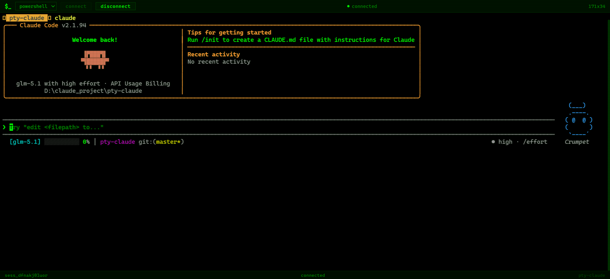
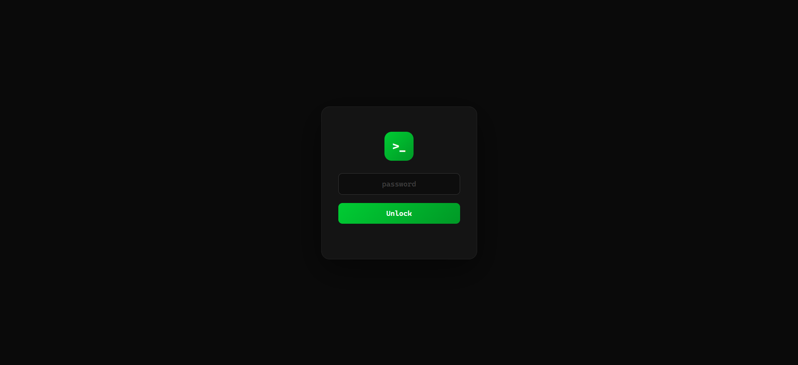
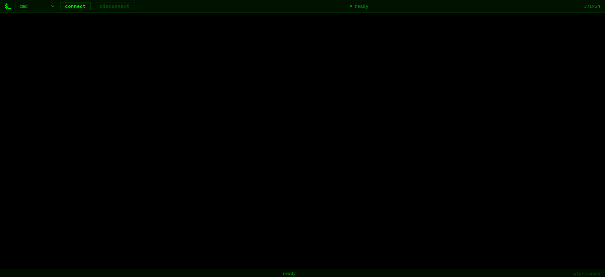

<p align="center">
  
</p>

<h1 align="center">pty-claude</h1>

<p align="center">
  <strong>Remote terminal access with a web UI</strong><br>
  Stream your ConPTY / PTY sessions to any browser — local or over the internet.
</p>

<p align="center">
  
  
  
</p>

---

## What it does

**pty-claude** is a lightweight Rust daemon that hosts terminal sessions and streams them over WebSocket to a web-based terminal UI. Open a browser, pick your shell (cmd, PowerShell, bash), and get a real terminal — from anywhere.

| Feature | Details |
|---|---|
| Web terminal | xterm.js-based green-on-black terminal in the browser |
| Shell selector | Choose cmd / PowerShell / bash from the toolbar |
| WebSocket streaming | Real-time I/O with ANSI color support |
| Password lock | Login gate before terminal access |
| PWA installable | Add to home screen on desktop or mobile |
| Cloudflare Tunnel | One-command public URL with `dev.sh` |
| Dual ports | Admin (localhost:18085) + Remote (public:18086) |

## Screenshots

<p align="center">
  
  &nbsp;&nbsp;
  
</p>

## Quick start

### Build & run

```bash
cargo build
cargo run -- serve
```

Open [http://127.0.0.1:18086](http://127.0.0.1:18086).

### With Cloudflare Tunnel (public URL)

```bash
./dev.sh
```

This builds the project, starts the server, and opens a Cloudflare Tunnel so you can share your terminal over the internet.

### CLI options

```bash
pty-claude serve [OPTIONS]

Options:
  --admin-host <HOST>     Admin bind address (default: 127.0.0.1)
  --admin-port <PORT>     Admin port (default: 18085)
  --remote-host <HOST>    Remote bind address (default: 0.0.0.0)
  --remote-port <PORT>    Remote port (default: 18086)
  --datadir <DIR>         Data directory path
  --no-discovery          Disable UDP discovery
```

## Architecture

```
 Browser                          Rust Server                    OS
 ───────                          ───────────                    ──
┌─────────┐   WebSocket    ┌──────────────┐   ConPTY/PTY   ┌──────────┐
│ xterm.js │◄────────────►│  axum + ws   │◄─────────────►│ cmd/bash │
│  web UI  │   JSON I/O    │  :18086      │   stdin/stdout │  ps1     │
└─────────┘               └──────────────┘               └──────────┘

                          ┌──────────────┐
                          │  admin API   │  :18085 (localhost only)
                          └──────────────┘
```

```
src/
├── main.rs            CLI entry point
├── net/               HTTP server, routes, WebSocket handlers
├── session/           Session management, ConPTY / PTY drivers
├── auth/              Device pairing & authentication
├── store/             File-based persistence
├── service/           Observation store
└── terminal/          Web UI (HTML, CSS, JS, PWA)
```

## API

| Method | Endpoint | Description |
|--------|----------|-------------|
| `GET` | `/health` | Health check |
| `GET` | `/` | Web terminal UI |
| `POST` | `/sessions` | Create terminal session |
| `GET` | `/sessions` | List active sessions |
| `POST` | `/sessions/:id/stop` | Stop a session |
| `POST` | `/sessions/:id/resize` | Resize terminal |
| `WS` | `/ws/sessions/:id` | Terminal I/O stream |
| `WS` | `/ws/overview` | Session overview |

## Web UI

The terminal frontend in `terminal/` is:

- **Zero build step** — plain HTML/CSS/JS, no bundler
- **xterm.js** from CDN for proper terminal emulation (cursor, ANSI colors, scrollback)
- **PWA-ready** — `manifest.json` + service worker for offline install
- **Responsive** — works on desktop, tablet, and mobile

### Customization

Search for these markers in the code to configure:

| Marker | File | What it controls |
|--------|------|-----------------|
| `[PASSWORD]` | `terminal/terminal.js` | Login password |
| `[WS-URL]` | `terminal/terminal.js` | WebSocket server URL |
| `[THEME]` | `terminal/style.css` | Colors and fonts |

## Tech stack

- **Rust** — tokio async runtime, axum HTTP framework
- **ConPTY** (Windows) / **POSIX PTY** (Linux) — native terminal drivers
- **xterm.js** — browser terminal emulator
- **Cloudflare Tunnel** — zero-config public access

## License

MIT
